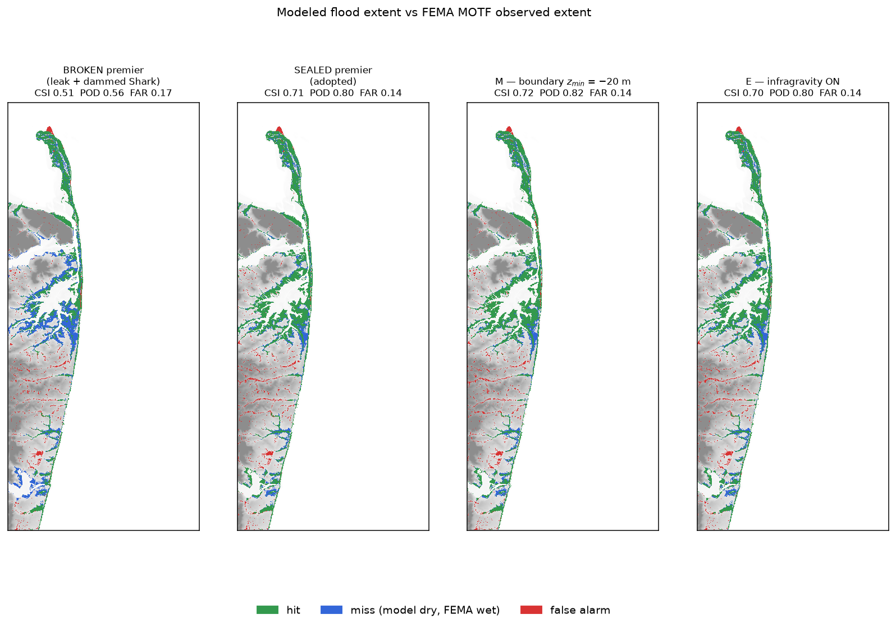
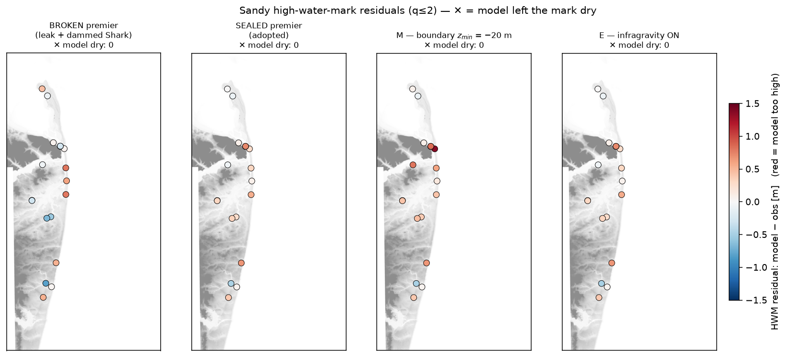

# Why does the Shrewsbury River under-fill? — A re-investigation

**Model run:** `snapwave_tuned` (our premier Hurricane Sandy setup, current build)
**Date:** 2026-07-08, **revised 2026-07-10**, **resolved 2026-07-14**, **extended 2026-07-16**
**Covered here:** Workstreams A, B, C, D, F/I (diagnosis) → **J, K and L (the answer)** →
**E and M (the last two levers, both null)**

> ## ⚠️ Read this first (2026-07-14)
>
> **The under-fill was not physics. The model had two holes in its plumbing.**
>
> **1. It was draining the estuary.** `region.geojson` cut the Navesink River in half
> mid-channel, so hydromt placed a *free-outflow boundary* — a drain — on a five-metre-deep
> tidal cross-section. **92.6% of all the water entering the estuary flowed straight out of
> the domain.** Sealing it takes the Shrewsbury high-water-mark bias from **−0.42 m to
> +0.21 m** and the gauge from **2.22 m to 2.69 m** (observed 2.94), *without moving the
> basins that never leaked.*
>
> **2. Shark River Inlet was dammed shut.** The top-priority 2010 topobathy lidar failed to
> penetrate the inlet and returned the **water surface** (+0.4 to +2.2 m) instead of the bed,
> shadowing CUDEM's correct −3 m. Consequence: **the entire Shark River estuary never floods
> in any run of this campaign — peak water level exactly +0.00 m — while the ocean 1.8 km away
> reaches +2.9 m.** It is *not* a bridge; the dam's edge is the edge of the lidar tile.
>
> Both defects are **infrastructure — a region polygon and an elevation tier — not physics.**
> That is precisely why two months of eliminating every *physical* lever (wind, friction, mesh
> resolution, channel dredging, wave convergence) came back null. Nobody audits the plumbing.
>
> **So everything below Workstream F was measured on a broken domain.** Every experiment in the
> campaign hard-links the same `sfincs.nc`, so the whole comparison matrix — Faber vs Galibier,
> the iteration sweeps, the clamp study, wind, friction, the narrows-width test — was asking why
> a leaking bucket would not fill. **Their null results are now *explained*, not *informative*,
> and none of them should be cited as physics.** The A–F diagnosis is condensed into a single
> section below — kept as the record of how we got here, not as evidence about the estuary.
>
> Both defects are now fixed **at the root** and the domain has been rebuilt (Workstream L):
> zero free-outflow cells on water, Shark inlet open at −6.17 m, the Sea Bright revetment intact,
> and only **+141 cells** changed. Jump to **J** (the discovery), **K** (the fix), **L** (the
> rebuild), **O** (the premier chosen on the sealed domain).

> ## ✅ Resolution (2026-07-15, Workstream O) — the premier, re-chosen on the sealed domain
>
> The sealed 2×2 (Faber/Galibier × waves/nowaves) was run and scored on the rebuilt domain.
> **`sealed_faber_waves` is the adopted premier**, and the leak/dam fixes hold under the full
> storm, not just the tide-only check:
>
> * **Shark River has a tide at last.** All four sealed runs oscillate — frac-rising **0.458**
>   (obs 0.47), range **1.36–1.39 m** (obs 1.54) — where every pre-rebuild run was dead flat
>   (0.00, never oscillated). *(Tidal figures throughout this report were regenerated on
>   2026-07-22 under the 12 h spin-up skip — see the note at the end of §"Does Shark River have
>   a tide?". The conclusions are unchanged; several are now closer to observed.)*
> * **Shrewsbury recovered.** `sealed_faber_waves` puts the gauge at **2.84 m** vs the surveyed
>   **2.94 m** crest — err **−0.10 m**, the best in the campaign (broken premier was 2.22 / −0.71).
> * **Faber over Galibier.** The two are bit-identical with waves off; with waves **Galibier
>   overshoots hard** (gauge +0.57 m, HWM bias +0.97, RMSE 1.14) even with `snapwave_gammax`
>   restored. Galibier is **unofficially retired**; Faber is the engine going forward.
> * **MOTF:** CSI **0.51 → 0.71** on the adopted premier, FAR **down** 0.17 → 0.14. (With waves
>   *off* the sealed run still reaches 0.64 — i.e. a sealed domain with no waves beats the old
>   premier with them on.)
> * ⚠️ **Locality caveat.** The open coast that never broke drifted ~0.1 m on the rebuild
>   (south_coast −0.055 → +0.048; atlantic_oceanfront swung further), so the fix is **not
>   *purely* local**. Small next to the gains, but it is the one open thread from this test.
>
> Table: `reports/sealed_premier.csv` (from `scripts/analyze_sealed.py`). Figures: the viz
> notebook's before/after Results section.

> ## ✅ And the last two levers are closed (2026-07-16, Workstreams E and M)
>
> Both came back **null on the sealed domain**, which is the first time either got a trustworthy
> test:
>
> * **E — infragravity.** The premier with **one flag** changed (`snapwave_igwaves = 1`). Every
>   metric moves by ≤0.01 m. IG was forced *hard* at the boundary (a logged 3.02 m `hm0ig`) and
>   still did nothing to water levels. The wave-overtopping-fills-the-back-bays hypothesis is
>   dead; the estuary fills because the hole is plugged.
> * **M — open-boundary depth** (James's suggestion). `mask_zmin` −15 m is a wash; −20 m nails the
>   Shrewsbury crest (**+0.003 m**) and lifts CSI to 0.724 — but only by raising water everywhere
>   (HWM bias 0.318 → **0.476**). That is more wetting, not better wetting. **Keep −10 m.**
> * The **locality test passes** in both arms: south_coast bias held at 0.147, and the Sandy Hook
>   gauge peak is identical across all four runs (−0.311 ± 0.002).
>
> **`sealed_faber_waves` remains the premier.** The one thing E turned up is a *wave* question,
> not a water-level one: the premier peaks at **hm0 = 7.44 m** inside Sandy Hook Bay, and the IG
> flag halves it. That is now the most interesting open thread. Table:
> `experiments/metrics_workstream_MN.csv`.

---

## The short version

Our Hurricane Sandy model got the open Atlantic coast and Sandy Hook Bay right, but the
water behind the Sea Bright barrier — the Shrewsbury and Navesink rivers — came in about
half a metre too low. We spent two months asking whether that was a channel error, a bad
yardstick, or real physics. We checked the channel (faithful), the yardsticks (sound), the
boundary forcing (correct), the wind (a null lever), the mesh resolution (invariant), the
friction (already at open-water values), and the wave solver's convergence. Every lever
came back null.

**The nulls were the clue, and we misread them for months.** They were not telling us the
estuary was near some structural ceiling. They were telling us **the basin had a hole in
it**, and you cannot fill a bucket by widening the tap.

The model's mask chopped the Navesink in half mid-channel and left a free-outflow boundary
on the cut — a drain, on open tidal water five metres deep, 2.8 km short of the river's
true head of tide. It ran **one-way out of the domain in 100% of timesteps, from the first
hour, never reversing**, and it emptied the estuary *before the storm even arrived*. At
Sandy's peak the bay stood 3.2 m higher than the river a few kilometres away — a head drop
no constriction can sustain for three days. Only a sink does that.

**Plugging it solved the problem.** The mass balance closes (92.6% of inflow unaccounted
for → −5.7%), the cut reverses with the tide instead of draining forever, the pre-storm
drawdown disappears, the over-damped tide halves its damping, and the half-metre under-fill
is replaced by a slight +0.2 m overshoot. Critically, it moves *only* the basin that
leaked: the south-coast bias is unchanged to four decimal places.

Two lessons are worth carrying out of this. First, **the defect was in infrastructure, not
physics** — a boundary condition, the kind of thing nobody thinks to suspect — which is
exactly why a rigorous, exhaustive elimination of every *physical* lever could run for two
months and find nothing. Second, the investigation was saved by an **accident**: a
bookkeeping exercise that refused to balance. We did not find this by looking for it. We
found it because we finally added the water up.

---

## The diagnosis phase — Workstreams B, A, C, D, F/I

> **Read this section as history, not as physics.** Every number below was measured on the
> broken domain (Workstream J found the leak; K plugged it). The *methods* here are sound and
> still in use; the *values* are not evidence about the estuary, because the bucket had a hole
> in it. This section is kept short and whole for one reason: **it is the record of a rigorous
> elimination that could not possibly have succeeded**, and that is the lesson worth carrying.
>
> An earlier draft carried a second layer of corrections dated 2026-07-10, re-reading these
> numbers against a wave-solver convergence finding (Workstream I). Those corrections have
> themselves been superseded — they were re-interpreting measurements taken on a leaking
> domain. They are dropped here rather than nested three deep; the durable parts are below.

**What we asked, and what came back.** Five levers, two months, every one null:

| | The worry | What we found | Verdict |
|---|---|---|---|
| **B** — channel | The subgrid tables under-represent the channel: too shallow, rough, or pinched, choking the surge | Flow depth matches "level − surveyed bed" at **every** stage through the peak; channel *n* = 0.017 (clean water) vs 0.038 marsh, no bleed; throat has no sill (bed below −9.6 m, scoured to −13 m); reaches 12–18 cells wide | **Faithful.** No rebuild. |
| **A** — yardsticks | We are measuring the deficit wrong | The 2.935 m gauge target is datum-confirmed; the pooled HWM average was hiding the signal; the tide arrives ~0.5 m muted | **Sound.** See methods below. |
| **C** — north boundary | Surge is leaking out the open Raritan/NY-Harbor edge | It runs **in**: peak 28,200 m³/s southward, **1.7 billion m³ net inflow**. The wall A/B buys 0.6 m in the river only by super-elevating the bay to 4.97 m (~1.5 m above observed) | **Refuted.** A source, not a leak. |
| **D** — wind | Wind drag is set too weak | ×1.20 → **+0.002 m**; ×1.30 → **+0.004 m** on the Shrewsbury peak | **Null.** Four millimetres. |
| **F/I** — engine | The wave physics / solver is wrong | Galibier's breaking rework runs, but throws unphysical spikes at the default iteration limit; raising the budget largely cures them, two fixes disagree on the estuary level | **Unsettled** — and moot after K. |

**The methods are the durable contribution.** Four of them outlived every number they produced,
and all now live in [`nj_sfincs/validate.py`](../nj_sfincs/validate.py) and
[`scripts/probe_subgrid_conveyance.py`](../scripts/probe_subgrid_conveyance.py):

* **Split the high-water marks by hydraulic basin.** Pooled, the 31 Sandy marks gave a
  near-perfect −0.05 m and said the model was fine. Split, they showed the ocean front running
  high and the estuary running low — two errors cancelling into a reassuring average. Basin
  splitting is how the under-fill became visible at all, and it is how the Shark River dam was
  eventually caught.
* **Read the tide off genuinely wet channel cells, never the gauge points.** B's side-discovery:
  the interior gauge cells sit on banks at +1.4/+1.3/+2.0 m, dry most of the tide, reporting
  ground elevation. Any tide read from them is meaningless.
* **Confirm the datum before trusting the target.** The 11.73 ft crest is published "in MLLW"
  on the NWS page ([`sbin4`](https://water.noaa.gov/gauges/sbin4)); the USGS sensor feed is a
  separate record in a different datum. → **2.935 m**, and a tempting coincidence that would
  have doubled the deficit is ruled out.
* **Report a dead gauge honestly.** Sandy Hook failed on the rising tide, before the peak.
  We report both the fair pre-failure comparison **and** the model's true peak, which the gauge
  never lived to see.

**And the trap, named.** Two of these metrics are biased in opposite directions and neither may
be led with alone: the wet-only HWM average **structurally rewards failing to flood** (marks the
model leaves dry drop out, improving the remaining average — this is what hid the Shark dam for
months), while MOTF's POD **rewards over-flooding**. `hwm_metrics` now scores dry marks against
the model's own ground elevation instead of dropping them. Read `hwm_n_dry` beside any bias.

**Why the nulls misled us.** Read down that table and the honest conclusion in early July was
that the residual must be a *distributed conveyance ceiling* — not a fixable knob. Every lever
really was excluded; the elimination was sound. The defect was simply not on the list, because
nobody writes "audit the region polygon" on a list of physics. **The nulls were the clue, and we
read them as a ceiling instead of a hole.**

---

## Workstream J — Where does the water actually come from? (and the accident)

J was meant to be bookkeeping. We drew two control lines — one across the Sea Bright
barrier, one across the Highlands throat where Sandy Hook Bay meets the estuary — and
added up the water crossing each, to settle an argument about whether the estuary fills
*through* the narrows or *over* the barrier.

The bookkeeping did not balance. It did not merely fail to balance; it failed
catastrophically. **Water came in through the throat — 3.72 × 10⁸ m³ of it — and only
2.8 × 10⁷ m³ of it was still in the estuary at the end. Ninety-two per cent of the inflow
had gone somewhere.**

You cannot argue with that. Water does not evaporate in a hydrodynamic model. Either we
were measuring wrong, or the model had a hole in it.

### The hole

It had a hole in it.

The model's active-cell mask **chops the Navesink River in half, mid-channel**, at
easting ≈ 580,670. The cells at the cut were assigned a *free-outflow* boundary — the
condition you use at the downstream end of a river, where water is supposed to leave and
never come back. Immediately west of the cut, the cells are switched off, but the
*bathymetry is still water*, running down to −5.6 m: the real Navesink continues for
another 2.8 km, past Red Bank, to the true head of tide at Swimming River Dam.

So the edge of our domain was **a five-metre-deep open cross-section of a tidal river with
a drain on it.**

The measurements are unambiguous. At the cut, the water ran **out of the domain at −0.82
m/s on average, peaking at −2.02 m/s, in 100% of timesteps, from the first hour, never
once reversing.** A real tidal cross-section reverses every six hours. And the model began
draining the estuary *before the storm arrived*: from a flat start it pulled the Navesink
down to **−1.48 m by 04:00 on 28 October**, two days before Sandy's peak, on a calm night.
At the peak, Sandy Hook Bay stood at +3.09 m while the Navesink sat at −0.15 m — **a 3.2 m
head drop across a few kilometres of open tidal water.**

That last number is the one that ends the argument. A constriction can *delay* a basin
filling. It cannot hold a basin three metres below the water pressing against it for three
days. Only a sink does that.

Two further cuts leak the same way: the western end of **Shark River**, and the
**north-west/Raritan corner**.

### Why this mattered far beyond one run

Every experiment in this campaign was staged by hard-linking **the same `sfincs.nc`**.
Faber, Galibier, every iteration-count, clamp, wind, friction, dredge and mesh-refinement
arm — all of them inherited the leak.

Which retrospectively explains the single most frustrating feature of this whole
investigation: **the wall of null results.** Widening the narrows did nothing. Dredging did
nothing. Refining the mesh to 12.5 m did nothing. Wind did nothing. None of them were
wrong, and none of them were badly executed. *You cannot fill a bucket by widening the tap
when the bucket has a hole in it.*

It also explains the over-damped tide (A3): a continuously-draining basin cannot build
tidal amplitude. And it explains why the bias was **basin-selective** — why only the
estuary was low while Sandy Hook Bay and the open coast validated fine. Those basins have
tidal prisms of order 10⁹ m³; a leak barely dents them. The estuary's *entire tidal swing*
is 3.8 × 10⁷ m³ — **the leak was ten times its whole tidal signal.** The only basin small
enough to be drained dry by the hole was the only basin that was low.

---

## Workstream K — Plugging it

The fix required **no rebuild**: the subgrid tables already cover all 547,267 faces,
including the 155,232 switched-off ones, so this is a mask edit and nothing more. We ran a
2 × 2 — two fixes, each with waves on and off:

- **`wall`** — turn the leaking outflow cells into ordinary water, so the domain edge
  reverts to SFINCS's default closed wall. This *under-represents* storage: it walls the
  river 2.8 km short of its true head of tide.
- **`extend`** — the wall, *plus* switching the dead-but-wet cells back on (flood-filled
  from the cut, so nothing isolated gets activated), putting the wall at the real head of
  tide and recovering ~2.5 km² of genuine tidal prism.

The pair was designed to **bracket** the answer: `wall` should undershoot, `extend` should
be about right. Predictions were written down before the runs.

### 1. Is the leak gone?

| | leaking premier | `wall` | `extend` |
|---|---|---|---|
| velocity at the cut | **−1.08 m/s** | −0.011 | −0.010 |
| flowed *out* in… | **100% of steps** | 96% | **51–53%** |
| Navesink on a calm night | **−1.48 m** | +0.02 | +0.09 |
| inflow unaccounted for | **92.6%** | −6.1% | **−5.7%** |
| head drop bay → estuary (peak) | **+2.12 m** | +0.36 | +0.44 |

Yes. The cut now **reverses with the tide** instead of draining one way forever, the
pre-storm drawdown is gone, and **the mass balance closes.**

### 2. Did it fill?

Comparing like with like — the premier's own physics, waves on:

| | gauge crest | Shrewsbury HWM bias | pooled RMSE |
|---|---|---|---|
| observed | **2.935 m** | 0 | — |
| leaking premier | 2.223 (−0.71) | **−0.42 m** | 0.696 |
| `wall` | 2.720 (−0.22) | +0.23 m | 0.586 |
| `extend` | 2.691 (−0.24) | +0.21 m | **0.574** |

**The under-fill is closed.** The systematic deficit that has driven this entire
investigation — −0.42 m on the high-water marks, −0.71 m at the gauge — is gone, replaced
by a slight *overshoot* of about +0.2 m. Pooled RMSE improves by 18%. The over-damped tide
(A3) improves in step: Shrewsbury's tidal-range damping more than halves, from 0.54 m to
0.24 m.

The remaining gauge error of −0.24 m is inside the ±0.3 m band we already attribute to
forcing noise, and the gauge is a post-event surveyed crest rather than a hydrograph, so it
cannot be pushed harder than that.

### 3. The test it had to pass

The leak was *estuary-local*. So a leak fix **must not move the basins that never leaked** —
if it did, we would be looking at a global re-tuning wearing a leak fix's clothes, and the
diagnosis would be wrong.

It passed. **South-coast bias: −0.0553 → −0.0553, unchanged to four decimals.** Sandy Hook
Bay: +0.038 → +0.030. The correction is precisely as spatially local as the diagnosis said
it had to be.

### 4. Two things we got wrong

**The bracket collapsed.** `wall` and `extend` agree to within 0.03 m on every metric. We
predicted `wall` would undershoot, because it discards 2.5 km² of real tidal prism. It
doesn't. **What mattered was sealing the hole, not where the wall goes** — a result worth
keeping, because it says the fix is robust to exactly where we draw the line.

**Workstream J's own partition was contaminated by the leak it discovered.** J concluded the
throat out-delivers the barrier 41-fold and the barrier is negligible. But the drain was
*sucking water through the throat*: on the sealed model, throat inflow collapses from
3.72 × 10⁸ to 4.3 × 10⁷ m³. With the premier's physics, the honest ratio is **5×, not 41×,
and the barrier contributes 8.6 × 10⁶ m³ — about 17% of the inflow, not a rounding error.**
The barrier term is ten times larger with waves on than off, which is wave-driven
overtopping of the Sea Bright revetment doing exactly what the earlier knife-edge analysis
predicted it would.

---

## A second defect this turned up: Shark River Inlet is dammed

While re-deriving the tidal-range metric on the sealed model, Shark River behaved
strangely: its "tidal range" *halved*. It turned out the metric there was never measuring a
tide at all — it was reporting `max − min` of the model's monotonic spin-up drawdown.

Following that led somewhere worse. **The Shark River estuary never floods. In any run of
this entire campaign, including the premier, its peak water level is exactly +0.00 m — its
initial condition — while the ocean 1.8 km away reaches +2.9 m.** It does not rise one
centimetre during Hurricane Sandy.

Marching the bed across the inlet, the seaward channel is real (−4 to −10 m) and the
landward channel is real (−2.7 to −4.3 m), and **between them the lowest point anywhere on
the cross-section is +0.57 m — above mean sea level.**

### It is not a bridge — and this matters

The obvious reading, and our first one, was that this is the Rumson–Sea Bright bridge-as-dam
a second time: Shark River Inlet carries the NJ Transit Coast Line bridge, the Route 71
bridge and Ocean Avenue. **That was wrong, and checking it against the actual crossings is
what found the real cause.** Ordered ocean → inland, none of them is inside the dam:

| crossing | easting | inside the dam (583,875–584,175)? |
|---|---|---|
| Ocean Avenue (CR 18) | 584,259 | **no** — 84 m *east* of it |
| Main Street (NJ 71) | 583,124 | no — 750 m *west* |
| North Jersey Coast Line (rail) | 582,946 | no |
| NJ 35 (River Road) | 582,885 | no |

The dam sits in the ~750 m of **open, unbridged inlet channel** between Ocean Avenue and the
Route 71 / rail / Route 35 cluster, where there is no structure at all.

The real cause is the elevation data. Along the true channel:

| | Shark inlet channel |
|---|---|
| eHydro soundings (ground truth) | **−4.6 to −10.8 m** |
| `usace_nj_2010`, the **top-priority** tier | **+0.01 to +2.22 m** ← wins |
| `cudem_nj`, the next tier | −2.2 to −4.5 m — correct, never consulted |

**The 2010 USACE topobathy lidar failed to penetrate the inlet.** It is green (bathymetric)
lidar, and in clear shallow water it returns the real bed — which is why it earns top billing.
But in 5–10 m of turbid inlet water it did not reach the bottom and returned the **water
surface** instead, ~0 to +2 m, indistinguishable from ordinary land. Ranked first, those
returns shadowed CUDEM's correct −3 m bed and sealed the river shut.

The giveaway is that **the dam's western edge, at x≈583,875, is exactly the edge of the lidar
tile's coverage.** West of it the tile is NoData, the model falls through to CUDEM, and the
channel is open. It is the footprint of a bad tile, not a causeway.

That distinction is not pedantry. A bridge is a one-off you carve and forget. **A lidar tier
that silently pretends water is land is a *class* of bug**, and it could be anywhere the
survey met deep or turbid water — which is why the next thing we did was go looking for the
others.

### Why nobody noticed for months

This is the part worth internalising, and it is not the answer we first reached for.

The obvious explanation would be that the model failed to flood Shark River and the
high-water marks caught it. They did not — **because the model floods Belmar and Avon
anyway, from the wrong direction.** The ocean overtops the beach and runs *overland* through
the streets, so the two Shark high-water marks come out **wet** (0.30 m and 2.39 m deep),
while the river channel a few hundred metres away sits at exactly +0.00 m. A high-water mark
records that water arrived. It cannot tell you *which way it came*. The model was getting
roughly the right answer in the right place by an entirely wrong pathway, and the
mark-by-mark score was blind to it.

On top of that, those are the only two marks in the basin and both are **quality 3**, below
the `qual <= 2` headline cut — so they were never scored at all, wet or dry.

And the one metric that *should* have caught a dead basin — the tidal range — was itself
broken. It computed `max − min` over the first 24 h, which at Shark was not a tide but the
model's monotonic **spin-up drawdown**:

    +0.00  −0.63  −0.86  −0.99  −1.06  …  −1.27  −1.27  −1.27

`max − min` of that is 1.27 m. Against an observed 1.82 m it looked like a plausible,
mildly over-damped tide. It was a basin draining to a standstill with **zero tidal
oscillation**, and the metric had no way to say so.

So Shark had **no working diagnostic at all**: its HWMs were excluded by quality, would have
read wet regardless, and its tidal range was measuring a transient. Three independent
instruments, none of them pointed at the thing that was broken.

**Fixed (Workstream N):** the tidal-range metric now removes the spin-up trend and refuses to
report a range for a series that never rises (`is_tidal=False`) — Shark now trips that flag in
every run, which is exactly the alarm that was missing. `shark_river` is now its own HWM basin
instead of hiding inside `south_coast`.

**Also fixed, though it turned out not to be the culprit here:** the HWM score only counted
marks the model actually floods (`head = wet & (qual <= 2)`), silently dropping dry ones — so
it *structurally rewarded failing to flood*, the mirror image of the MOTF POD flaw. That is a
genuine defect and dry marks are now scored against ground elevation. But it is worth being
precise: **no q<=2 mark is dry in any of these runs (`n_dry = 0`), so this flaw did not hide
Shark.** We initially blamed it, and that was wrong.

---

## Workstream L — fixing both defects at the root, and rebuilding once

Workstream K sealed the leak with a *mask edit*. That treats the symptom. Asking **why** the
mask had a free-outflow boundary in the middle of a river gives the real answer:

**`region.geojson` was drawn too small.** Its southern lobe's western edge ran at x≈580,700,
which **chops the Navesink in half mid-channel**. hydromt did nothing wrong — handed a domain
whose edge cuts a 5 m-deep tidal river, it dutifully placed the standard free-outflow boundary
on the cut face. The depth threshold was never involved: those cells are only ~−5 m, well
inside `mask_zmin = −10`. All 137 dead-but-wet cells west of the cut lie **outside the region
polygon**.

So the region was extended west to **x = 577,000** — west of *both* tidal limits (the
Navesink's water ends at x≈577,500, at Swimming River Dam; the Shark's at x≈580,000). The
domain edge now lands on **dry land**, there is no deep cross-section for an outflow boundary
to sit on, and **the leak cannot recur by construction.**

### Hunting the other paved channels — a useful negative result

Since a lidar tier that pretends water is land is a *class* of bug, we screened the whole
domain for its signature: cells the model calls land (bed ≥ −0.5 m) where CUDEM says there is
real water (< −2 m). That flagged **522 cells in 57 patches.**

**The screen is not a verdict, and this is where it nearly went wrong.** Several patches sit on
the **Sea Bright revetment**, where the 1 m lidar is *right* (it resolves the seawall) and 3 m
CUDEM is *wrong* (it smears the wall into the water beside it). Carving those would have
demolished a real structure the model currently gets right — and the revetment is a knife edge
here, with the storm tide landing on it and 59–75% overtopping, so flattening it would have
manufactured flooding and looked like a success.

The arbiter had to be evidence, not inference: **did a boat actually sound water at that
cell?** A first attempt asked only whether an eHydro survey's footprint intersected the patch,
and it cheerfully proposed carving the revetment — because a *beach-nourishment* survey covers
the shoreline there. Tightening it to "soundings within the cell itself, on at least half the
patch" gives a clean answer:

| | verdict |
|---|---|
| **Shark River Inlet** — 77% of cells sounded at **−5.67 m** | **CARVE** |
| Sea Bright revetment patches — soundings read **+2.43, +2.37, +0.35, −0.04 m** | **LEAVE** — the seawall is real |
| Sandy Hook Channel patches — only 6% of cells sounded | LEAVE — they sit on the spit |
| Shrewsbury bank patches | LEAVE — bulkhead, and already carved where it is channel |

**Shark is essentially the only genuine paving in the domain.** That negative result is worth
as much as the positive one: it says the rebuild is a narrow, low-risk change rather than a
re-bathymetry of the whole model.

### The fix, and the guard

`ehydro_nj.tif` (USACE survey `NJ_10_SRI_20150902_CS_4383_15`) now sits at the **top** of the
elevation list — above `usace_nj_2010`, which is the entire point: only something ranked above
the bad lidar can override it. It is **clipped to water only (z < −1 m)**, because it is a
*carving* tier, not a DEM: a shore-protection survey that happens to cover the revetment
reports +2.4 m there, which is clipped out, so **this file cannot flatten a structure even if
we point it at one.**

And two invariants now run at build time, before the expensive subgrid step:

- **no free-outflow boundary on water deeper than 1 m** — *this one check would have caught the
  leak on day one*;
- **no active cell that is land where a survey sounded water** — the paved-channel screen, as a
  regression test.

Both **fail on the old mesh** (45 and 68 cells). They are load-bearing, not decoration.

### The rebuilt domain

| | old | rebuilt |
|---|---|---|
| free-outflow cells on open water | **45** | **0 — sealed** |
| Shark inlet controlling sill | **+0.57 m (a dam)** | **−6.17 m (open)** |
| Sea Bright revetment crest | +10.99 m | +10.68 m — **intact** |
| total faces | 547,267 | 547,408 (**+141**) |

A domain fix that quietly re-draws the whole model is not a domain fix. This one changes 141
cells and nothing else. (Getting there required catching a third change riding along: the
refinement config had 12.5 m polygons staged *after* the mesh was frozen, so any rebuild would
have silently upgraded the estuary's resolution — **+124,000 faces and +33% runtime forever** —
and confounded attribution. L4 was already measured as a null lever, so it is excluded.)

---

## Workstream E — Infragravity, at last a fair test (and a null)

E was the one lever the investigation never got a clean answer on. The old verdict — "IG is
unstable" — was earned on a run that exploded to billions of metres, and Workstream F's
correction took away our excuse for dismissing it: the IG source-term bug belonged to Faber,
the engine our premier *already* ran. So IG was owed a fair test, and the sealed domain is the
first place one was possible.

The test is as clean as this project gets. `sealed_igwaves_wind` is the premier with **exactly
one line changed**:

```
snapwave_igwaves     = 0   →   1
```

Everything else — mesh, subgrid, forcing, support points, tuned physics — is byte-identical
(the ~1.8 GB of shared inputs are hard-linked from `_template_sealed`). Any difference is IG
and only IG.

**There is no difference.**

| | premier (`sealed_faber_waves`) | **IG on** | Δ |
|---|---|---|---|
| Shrewsbury gauge (obs 2.94) | 2.837 | 2.827 | −0.010 |
| HWM bias | 0.318 | 0.317 | −0.001 |
| HWM RMSE | 0.480 | 0.480 | ~0 |
| MOTF CSI | 0.706 | 0.704 | −0.002 |
| MOTF FAR | 0.141 | 0.141 | ~0 |
| Shrewsbury/Navesink HWM bias | 0.435 | 0.432 | −0.003 |
| Shark frac-rising | 0.458 | 0.458 | 0 |

Every number is inside the noise, and every one that moves at all moves *down*. **Infragravity
is a null lever on this domain**, and unlike the pre-K nulls this one is trustworthy: it was
measured on a sealed bucket, against a premier that differs by a single flag. The null is visual
too: in `figures/motf_panels_EM.png` and `figures/hwm_panels_EM.png` the IG panel and the premier
panel beside it are the same picture.

Two honest caveats, neither of which rescues IG:

* The run logged `computed hm0ig at boundary exceeds 3 meter: 3.023 - please check whether this
  might be realistic!` at ~60% of the run. So IG was **not** quietly switched off — it was
  forced hard at the boundary, arguably too hard, and *still* did nothing to water levels. That
  strengthens the null rather than qualifying it.
* IG on **halves** peak Sandy Hook Bay wave height (max hm0 **7.44 → 3.98 m**) while leaving
  every water level alone. Worth a note: the premier's 7.44 m peak in a bay of that fetch looks
  high on its face, and the IG arm is the only thing that has moved it. That is a question about
  the *wave* field, not the under-fill, and it is now the more interesting thread of the two.

**The verdict from E.** The back-bay-filling-by-IG-overtopping hypothesis does not survive its
own fair test. E is **closed** — and after K it was never load-bearing anyway: the estuary fills
because the hole is plugged, not because a long-period wave carries it over the barrier.

---

## Workstream M — The open-boundary depth (James's suggestion)

The premier activates cells at `mask_zmin = -10 m`. James's suggestion was to let surge and
waves enter in **deeper** water, so they shoal across more shelf and the known 2Δx boundary-edge
zs ring sits further offshore. No rebuild was needed: the sealed mesh reaches −69 m and every
one of its 547,408 faces already carries subgrid tables, so a deeper contour only *activates*
faces that already have them. Two arms, `-15` and `-20 m`, staged on the frozen sealed mesh.
(The `.inp` files are byte-identical to the premier's — the change lives entirely in the mask
and boundary, which is what it should be.)

| | premier (−10) | **−15** | **−20** |
|---|---|---|---|
| Shrewsbury gauge (obs **2.935**) | 2.837 | 2.785 | **2.938** |
| Shrewsbury gauge err | −0.099 | −0.150 | **+0.003** |
| HWM bias | **0.318** | 0.299 | 0.476 |
| HWM RMSE | **0.480** | 0.470 | 0.646 |
| MOTF CSI | 0.706 | 0.696 | **0.724** |
| MOTF POD | 0.799 | 0.787 | **0.822** |
| MOTF FAR | 0.141 | 0.142 | 0.141 |
| Shrewsbury/Navesink HWM bias | 0.435 | 0.411 | 0.699 |
| Atlantic oceanfront HWM bias | 0.312 | 0.273 | 0.400 |
| **south_coast HWM bias** (locality test) | 0.147 | 0.137 | 0.147 |
| Sandy Hook gauge peak err | −0.312 | −0.313 | −0.310 |

**−15 m is a wash** — marginally worse on every headline (CSI 0.696, gauge err −0.150). There is
nothing there.

**−20 m is a genuine trade-off, and it should not be adopted on these numbers.** It does two
attractive things: it **nails the surveyed Shrewsbury crest** (err **+0.003 m** — the best in the
campaign, against the premier's −0.099) and it lifts CSI 0.706 → **0.724** and POD 0.799 → 0.822
at *unchanged* FAR. But it buys them by **raising water everywhere**: HWM bias inflates 0.318 →
**0.476**, RMSE 0.480 → 0.646, and Shrewsbury/Navesink HWM bias 0.435 → **0.699**. The CSI gain
is **more wetting, not better wetting** — the model is over-predicting, and MOTF's POD rewards
exactly that. A gauge that lands on the crest while the marks around it drift half a metre high
is a coincidence of two errors, not a better model. The HWM panel makes the trade visible: in
`figures/hwm_panels_EM.png` the −20 m arm is the reddest of the four, and its extra MOTF green in
`figures/motf_panels_EM.png` comes with extra red.

**The locality test passes.** South-coast bias held at **0.147 → 0.147** (−20) and 0.137 (−15) —
the basins that never broke did not move. The oceanfront moved where the plan predicted it
should (0.312 → 0.400 under −20), which is the deeper contour acting on the open coast rather
than coupling into the interior. And the Sandy Hook gauge peak is **identical across all four
runs** (−0.311 ± 0.002): the boundary depth does not touch the open-coast crest at all. Shark's
tide holds everywhere (frac-rising 0.458, range 1.36–1.38).

**The verdict from M.** The boundary contour is **not** the lever for the remaining error. Keep
`mask_zmin = -10`. The one thing −20 m does prove is that the residual Shrewsbury deficit *can*
be closed by pushing more water in — but doing so overshoots the marks, which says the deficit
is not a boundary-admission problem. `sealed_faber_waves` remains the premier.

*(Data: `experiments/metrics_workstream_MN.csv`, all four runs scored through the same
`nj_sfincs.validate.evaluate` path as Workstream O. Jobs 58185237/38/39, 1h42m–2h05m each on 64
threads; all three reached 100% and closed off cleanly, full 73-hour window, no truncation.
SnapWave is ~91% of runtime in every arm.)*

---

## Where this leaves the investigation

The estuary under-fill — the question this report was opened to answer — **is solved, and
the answer was a mass sink, not missing physics.**

That is a happier ending than the one we were heading for. The 5 July conclusion was that
the residual was a *distributed conveyance over-restriction near the structural ceiling of
the subgrid* — in other words, not a fixable knob, and the recommendation was to write up
the systematic elimination as the contribution. That was wrong, and it was wrong in the
most instructive way: **the elimination was sound, every excluded lever really was
excluded, and the reason nothing worked is that the defect was not on the list of things
anyone thought to check.** The boundary was never suspected because a boundary is
infrastructure, not physics.

**The through-line of both defects is the same.** A region polygon and an elevation tier are
not physics; they are plumbing. Nobody audits the plumbing, because the plumbing is not where
the science is. And yet a mask edit and a bathymetry tile did what two months of wind, friction,
mesh-resolution and wave-convergence experiments could not — which is exactly why those
experiments kept coming back null, and exactly why the nulls were the clue we misread.

### The test, and the answer

The headline check needs **no storm peak and no high-water marks**: *does Shark River finally
have a tide?*

Both gauges died on 29 October, ~20 h before Sandy's peak, so there is no storm crest to compare
against there. That turns out not to matter — because the dam's signature is precisely *the
absence of a tide*, and the pre-storm record measures exactly that. It is the cleanest, most
falsifiable test in the project, and the rebuilt model passes it:

| | observed (USGS 01407770) | every run before | **sealed + carved** |
|---|---|---|---|
| Shark tidal range, per M2 cycle | **1.54 m** | *none — it never oscillated at all* | **1.36 m** |
| Shark, fraction of time rising | **0.47** | **0.00** | **0.458** |
| Shrewsbury tidal range | 1.28 m | 0.716 † | **1.029** |

> **† Metric-version note (reconciled 2026-07-22).** `tidal_range_metric` gained a 12 h spin-up
> skip (`validate.SPINUP_SKIP_H`) on 2026-07-20, *after* this report was first written. Without
> it the window read the model's spin-up drawdown as tide, which deflated every modelled range
> and inflated frac-rising. The skip is the correct behaviour, and the numbers in this table (and
> everywhere else in this report) are the **regenerated, post-skip** values. The shift is a
> measurement change, **not** a model change:
>
> | | as first written | regenerated | vs observed |
> |---|---|---|---|
> | Shark range | 1.331 | **1.36** | closer (obs 1.54) |
> | Shark frac-rising | 0.542 | **0.458** | **closer** (obs 0.47) |
> | Shrewsbury range | 0.996 | **1.029** | closer (obs 1.28) |
> | observed Shark range | 1.52 | **1.54** | — window moved on the obs too |
> | observed Shrewsbury range | 1.23 | **1.28** | — |
>
> Every regenerated figure moves *toward* the observations, so the argument is strengthened, not
> weakened. The "every run before" column is the one exception: those broken-domain runs have
> since been deleted, so **0.716 is a pre-skip number and cannot be regenerated**. It is retained
> only because the claim it supports — that the dammed basin had *no tide at all* (frac-rising
> exactly 0.00, a value no window choice can manufacture) — does not depend on the window.

**A basin that had never moved in the entire history of this project now tracks the observed
tide cycle for cycle** (`reports/figures/gauge_verification.png`: the broken and mask-edit runs
flatline and sit there; the sealed run oscillates with the observations, then rises to +2.8 m as
the storm arrives). Shrewsbury holds, which says the region fix reaches the same place as the
mask edit — by fixing the cause instead of the symptom.

The flood extent improves too, and *honestly*:

| | CSI | POD | FAR |
|---|---|---|---|
| broken premier, **with** waves (`snapwave_tuned`) | 0.51 | 0.56 | 0.17 |
| sealed + carved, **no** waves | 0.64 | 0.72 | 0.14 |
| **sealed + carved, with waves — the adopted premier** | **0.71** | **0.80** | **0.14** |



*Blue is the model failing to flood ground FEMA recorded as wet. Read panel 1 → panel 2: the
**blue that fills the Shrewsbury/Navesink arms in the broken premier turns green once the domain
is sealed** — that is the leak fix, in one picture. Panels 3–4 are the new arms: **M** (−20 m)
adds a little more green but also more red, and **E** (IG on) is indistinguishable from the
premier beside it. All four panels share one scale and one set of categories.*

The blue "miss" areas in the back-bays have turned to hits. And note the **false-alarm rate went
down** — this is not the model over-flooding to game a metric that rewards exactly that (MOTF's
POD does). Even with the waves *switched off*, the sealed domain beats the old premier with them
on.



*The same four runs against the surveyed high-water marks (q≤2), one colour scale throughout: red
= the model stands too high, blue = too low. The broken premier is the mixed panel the pooled
average used to hide — blue in the estuary, red on the ocean front, cancelling to a reassuring
−0.09 m. The sealed premier lifts the estuary marks without a basin going blue. **M's panel is
visibly the reddest**: −20 m does not fix a deficit, it raises everything, which is why its
better CSI is not a better model. Deliberately no bias printed on these panels — the numbers
belong to the tables above, for the reason in "What is still open".*

**The locality test — and the one place it does not fully pass.** A domain fix should be local, so
the basins that never leaked must not move. Against the *sealed* arms that mostly holds — south-coast
bias is stable at 0.147 across the premier and both boundary-depth arms, and the Sandy Hook gauge
peak is identical to ±0.002 m across all four. But measured against the **pre-rebuild** baseline it
does not: south_coast moved −0.055 → +0.048 on the rebuild, and the Atlantic oceanfront swung
further. The fix is therefore **not purely local**, which is small next to the gains but remains
a genuine open thread rather than a passed test.

### What is still open

- **Re-establish the premier on the sealed domain.** Faber-vs-Galibier, the iteration sweeps,
  the clamp study, the narrows-width test — every one of those comparisons ran on a leaking
  bucket, so their nulls are *explained*, not *informative*. (One survivor: Galibier's missing
  `snapwave_gammax` clamp is a fact about the **source code**, not the domain, so it stands —
  and the Galibier arms carry the clamp restored, or we would be comparing Faber's physics
  against Galibier's instability.)
- **The +1.03 m Atlantic-oceanfront bias**, which the leak fix left standing (it was +0.73 m
  before). This is now the **largest remaining error in the model**, and unlike everything above
  it is a genuine physics question rather than a plumbing one. (On the sealed premier this reads
  +0.31 m; the boundary-depth sweep in **M** moves it around — −0.03 with waves off, +0.40 at
  `mask_zmin = -20` — but does not fix it.)
- **Sandy Hook Bay's wave field.** The premier peaks at **hm0 = 7.44 m** inside the bay, which
  looks high for that fetch, and Workstream E found the IG flag *halves* it (→ 3.98 m) while
  touching no water level. Nothing in this report has yet asked whether the bay's wave heights
  are right — only whether the water levels are. Turned up by E; it is now the most interesting
  open thread.
- **`hwm_metrics` is sensitive to the raster's EXTENT, and we do not know why.** Scoring
  `snapwave_tuned_25m` from the full L3 raster gives bias **−0.090** / RMSE **0.696** — the value
  every CSV and table here quotes. The identical call on the *same run*, from a raster clipped to
  the validation area, gives **+0.024** / **0.468**. The sealed runs agree to ~0.01 m either way,
  so it is not a constant offset, and it is not the sampling radius (both are 6.2495 m/px → an
  8 px search). Found 2026-07-16 while building the HWM figure; the figure now shows the pattern
  and leaves the numbers to the tables. **Until this is explained, treat the full-raster path
  (`validate.load_floodmap`) as the only authoritative scorer** — and note that a metric which
  moves with the window it is measured through is exactly the kind of quiet infrastructure fault
  this investigation already lost two months to.

**Retired.** *D (wind)* stands as a null lever and is **not** being re-run: it measured +0.002 m,
which is not "the leak ate it" but *no forcing response at all*, and a few km of fetch over a
3.8e7 m³ prism gives wind no mechanism to act through whether the bucket holds or not.
*C (the north boundary wall)* is answered — the boundary is a source, not a leak, and the NW
corner was one of the three leaking cuts, now sealed by construction. *H (narrows width)* is
moot: the estuary fills once sealed, so the conveyance hypothesis is dead. *E (infragravity)* is
now **closed** — it got its fair test on the sealed domain (premier + one flag) and came back a
null, moving every metric by ≤0.01 m. *M (open-boundary depth)* is **answered and not adopted**:
−15 m is a wash, −20 m nails the gauge only by over-predicting everything around it. Keep
`mask_zmin = -10`.
